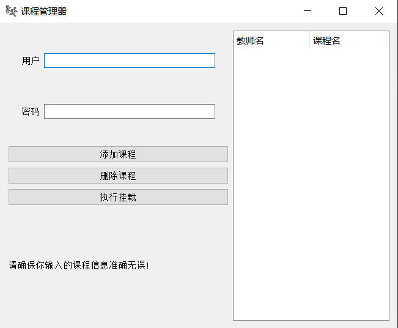

## Course Spider for USST

​	Course Spider for USST是一款基于Python的后台挂载工具，主要用于在USST（上海理工大学）教务处自动检查是否有课程余量并进行合适操作。本项目旨在为学生提供方便快捷的课程获取途径，助力高效学习。

##### 项目特点：

1. 采用Splinter库进行网页解析，轻松应对复杂网页结构。
2. 使用PyQt5库编写用户界面，界面简洁、操作便捷。
4. 自动化精准匹配课程信息，节省学生选课时间。
5. 支持查看选课页面，为学生提供动态视图。

##### 适用人群：

1. USST Humble Students.
2. 想要学习Splinter和PyQt5编程技术的开发者。

##### 使用说明：

1. 安装本项目所需依赖：详见 requirements.txt
2. 项目主程序：python UI_main.py
2. 项目只支持Chrome（谷歌浏览器）和Edge浏览器
3. 根据提示操作，即可开始体验选课后台挂载。

##### 注意：

1. 请遵循相关法律法规，合理使用爬虫技术。
2. 项目中涉及到的网址、图片等资源，请确保合规获取。

##### 参考文档：

1. [Splinter官方文档](https://splinter-docs-zh-cn.readthedocs.io/zh/latest/index.html)
2. [PyQt5参考案例](https://zhuanlan.zhihu.com/p/482754031)

如有问题，请查阅项目文档或联系作者。感谢您的使用，祝您学习愉快！
