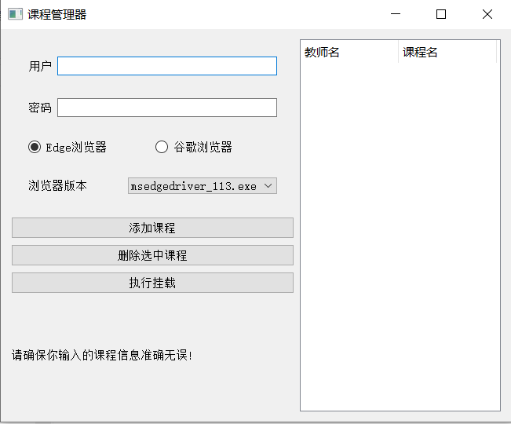

## Course Spider for USST（上理工抓课工具）

​	Course Spider for USST是一款基于Python的后台挂载工具，主要用于在USST（上海理工大学）教务处自动检查是否有课程余量并进行合适操作。本项目旨在为学生提供方便快捷的课程获取途径，助力高效学习。

​	**一体化整合安装包链接：https://www.alipan.com/s/Ew86BpwSn4S（密码：g6t8）**

​	




##### 项目特点：

1. 采用Splinter库进行网页解析，轻松应对复杂网页结构。
2. 使用PyQt5库编写用户界面，界面简洁、操作便捷。
3. 自动化精准匹配课程信息，节省学生选课时间。
4. 支持查看选课页面，为学生提供动态视图。

##### 更新事项：

1. 界面代码优化。
2. 兼容谷歌与Edge浏览器的多种内核，可根据版本自行替换。
2. 自动释放浏览器驱动。

##### 适用人群：

1. USST Humble Students.
2. 想要学习Splinter和PyQt5编程技术的开发者。

##### 使用说明：

1. 安装本项目所需依赖：详见 requirements.txt

   在合理的python（虚拟）环境下，使用终端代码进行安装：

   ```
   pip install -r requirements.txt
   ```

2. 项目主程序：python UI_main.py

3. 项目目前只支持Chrome（谷歌浏览器）和Edge浏览器

4. 根据提示进行操作，输入所需信息，即可开始体验选课后台挂载。

##### 注意：

1. 请遵循相关法律法规，合理使用爬虫技术。
2. 项目中涉及到的网址、图片等资源，请确保合规获取。
2. 项目本身不会采集用户的任何信息，请确保在安全的环境下使用程序。

##### 参考文档：

1. [Splinter官方文档](https://splinter-docs-zh-cn.readthedocs.io/zh/latest/index.html)
2. [PyQt5参考案例](https://zhuanlan.zhihu.com/p/482754031)

如有问题，请查阅项目文档或联系作者。感谢您的使用，祝您学习愉快！